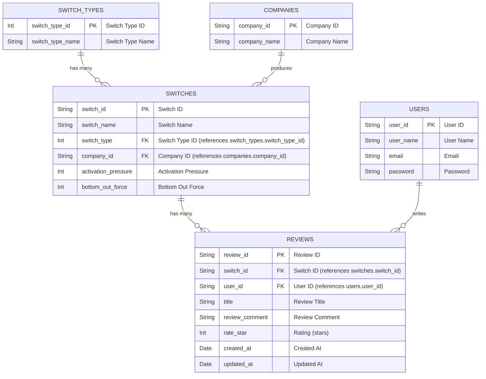

# プロダクト概要
このレポジトリはKICの授業課題のために作ったレポジトリです。

作成するシステムの条件は以下です。
```
• At least the following elements are included
1. Use the PHP and the MySQL Database
2. At least two or more tables in database
3. Have the functions to insert, update, delete the data
4. Have the function to search the data.
```

# バックエンド側
## DB
5つのテーブルがあります
1. switches
2. reviews
3. users
4. switch_types
5. companies


| テーブル名 | カラム名 | データ型 | 説明 |
|------------|-----------|----------|------|
| switches | switch_id | String | スイッチのID |
|          | switch_name | String | スイッチの名前 |
|          | switch_type | Int | スイッチタイプのID（`switch_types.switch_type_id`を参照） |
|          | company_id | String | 会社のID（`companies.company_id`を参照） |
|          | activation_pressure | Int | アクチュエーション圧力 |
|          | bottom_out_force | Int | ボトムアウトフォース |
| reviews | review_id | String | レビューのID |
|         | switch_id | String | スイッチのID（`switches.switch_id`を参照） |
|         | user_id | String | ユーザーのID（`users.user_id`を参照） |
|         | title | String | レビューのタイトル |
|         | review_comment | String | レビューのコメント |
|         | rate_star | Int | レート（星の数） |
|         | created_at | Date | レビューの作成日 |
|         | updated_at | Date | レビューの更新日 |
| users | user_id | String | ユーザーのID |
|       | user_name | String | ユーザー名 |
|       | email | String | ユーザーのメールアドレス |
|       | password | String | ユーザーのパスワード |
| switch_types | switch_type_id | Int | スイッチタイプのID |
|              | switch_type_name | String | スイッチタイプの名前 |
| companies | company_id | String | 会社のID |
|           | company_name | String | 会社の名前 |



### phpMyAdminの使い方
sshトンネルを使う

> ssh -N -L 8888:127.0.0.1:80 -i /Users/user/.ssh/xxxxx.pem bitnami@xxxx.xxx.xxx


# フロント側
## ページ構成
4ページ構成です。
1. スイッチ一覧ページ
2. スイッチ詳細ページ（含むレビュー一覧）
3. レビュー投稿ページ
4. ログインページ

### スイッチ一覧ページ
画面要素
1. スイッチ名検索窓
2. 絞り込み検索窓（スイッチタイプ、動作圧）
3. スイッチ一覧

**スイッチ名検索窓**
- スイッチ名をテキスト検索できる

**絞り込み検索窓**
- スイッチタイプとアクチュエーション圧力によって表示されているアイテムを絞り込みできる

**スイッチの一覧**
- スイッチの名称、スイッチのタイプ、アクチュエーション圧力、ボトムアウトフォースを表示する
- 各アイテムをクリックするとスイッチ詳細ページに遷移する

### スイッチ詳細ページ
画面要素
1. スイッチ名
2. スイッチタイプ
3. 会社名
4. アクチュエーション圧力
5. ボトムアウトフォース
6. レビュー一覧
7. レビュー投稿ボタン

**スイッチ名**
- スイッチの名称を表示する

**スイッチタイプ**
- スイッチのタイプを表示する

**会社名**
- スイッチの会社名を表示する

**アクチュエーション圧力**
- スイッチのアクチュエーション圧力を表示する

**ボトムアウトフォース**
- スイッチのボトムアウトフォースを表示する

**レビュー一覧**
- スイッチに対するレビューを表示する
- それぞれの要素は、レビューのタイトル、レビューのコメント、レート（星の数）を表示する

**レビュー投稿ボタン**
- そのスイッチのレビュー投稿ページに遷移する

### レビュー投稿ページ
ログインしていなかったらログインページに遷移する

画面要素
1. レビュータイトル
2. レビューコメント
3. レート（星の数）
4. 投稿ボタン

**レビュータイトル**
- レビューのタイトルを入力する

**レビューコメント**
- レビューのコメントを入力する

**レート（星の数）**
- レビューのレートを選択する

**投稿ボタン**
- レビューを投稿する

### ログインページ
- メールアドレスとパスワードによる認証を行う
```
